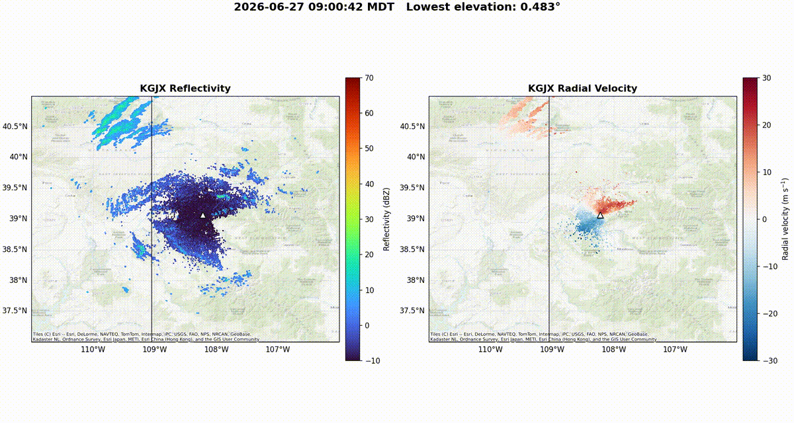

# nexrad-radar-analysis
Downloads, processes, and visualizes level II NEXRAD radar data.

## Running the Radar Animation

The provided example downloads and visualizes NEXRAD Level-II radar data from the **KGJX (Grand Junction, Colorado) radar** for June 27, 2026, from 0900–1600 MDT.

### 1. Create the Python environment

Create and activate a virtual environment:

```bash
python3 -m venv radar-venv
source radar-venv/bin/activate
```

Install the Python dependencies:

```bash
python -m pip install --upgrade pip
pip install -r requirements.txt
```

FFmpeg is also required to create the MP4 animation:

```bash
sudo apt install ffmpeg
```

### 2. Download the radar data

Run:

```bash
python download_radar.py
```

This downloads the KGJX NEXRAD Level-II files for the specified time period from the NOAA AWS archive.

The downloaded files are stored in:

```text
kgjx_level2_20260627/
```

The download script can be safely run again; files that have already been downloaded are skipped.

### 3. Create the radar animation

After the radar data have been downloaded, run:

```bash
python plot_radar.py
```

The plotting script:

- Reads the local NEXRAD Level-II files.
- Identifies the lowest positive-elevation radar sweep.
- Selects the appropriate reflectivity and radial-velocity sweeps independently.
- Plots lowest-elevation **reflectivity (dBZ)** and **radial velocity (m/s)**.
- Places the radar data on a geographic map with topography and roads.
- Creates an MP4 animation covering the available radar scans.

The resulting animation is:

```text
kgjx_20260627_0900-1600_MDT.mp4
```

### Output

The final animation contains two synchronized panels:

- **Reflectivity** — precipitation/echo intensity in dBZ.
- **Radial velocity** — motion toward or away from the radar in m/s.

The animation provides a time-evolving view of the lowest-elevation radar observations during the June 27, 2026 study period.


## Example radar animation


